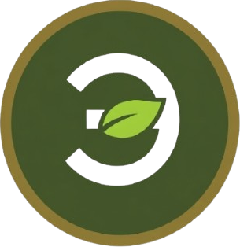
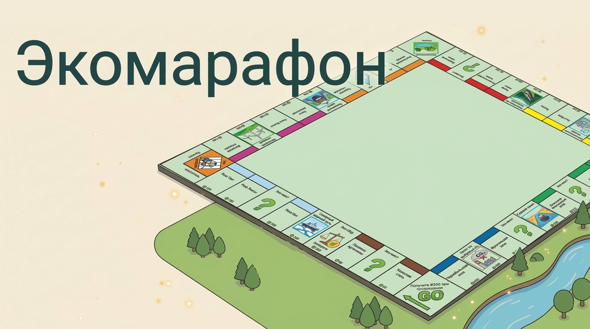
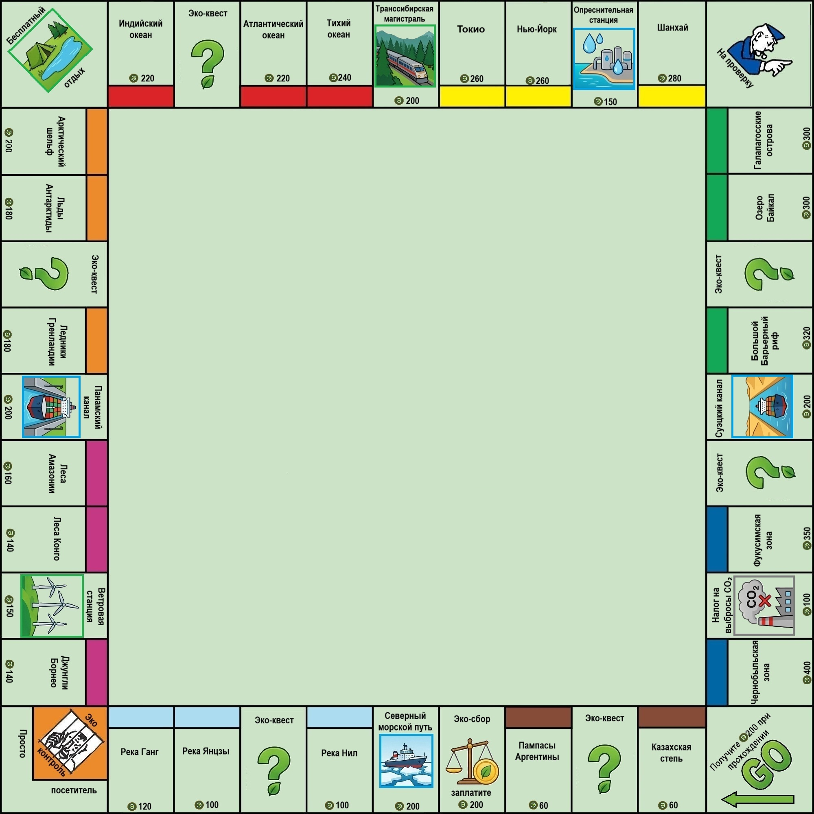
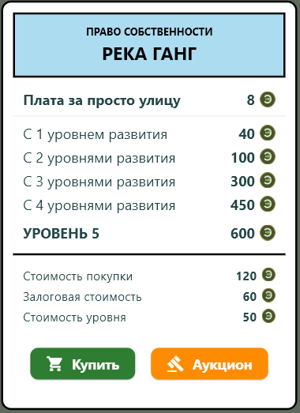

<h1 align="center">🌿 Экомарафон</h1>

<p align="center">
  
</p>

<p align="center">
  <b>Многопользовательская пошаговая экономическая стратегия в духе «Монополии», посвящённая экологии и устойчивому развитию.</b>
</p>

<p align="center">
  
  
  
  
</p>

---

<p align="center">
  
</p>

---

## О проекте

**Экомарафон** — это многопользовательская пошаговая стратегия, основанная на классических принципах «Монополии». Игроки перемещаются по замкнутому полю из **40 клеток**, приобретают экологические активы (территории, транспортные компании, очистные сооружения), взимают ренту с соперников и участвуют в образовательных **эко-квестах**.

Игровая валюта — **экокойны** .

### Отличия от классической «Монополии»

- 🌍 **Тематическое оформление** — все клетки связаны с экологией и географией: Байкал, Галапагосские острова, Суэцкий канал, Чернобыльская зона, Панамский канал, реки Ганг, Нил, Янцзы и другие. Все эти клетки можно улучшать.
- ❓ **Эко-квесты вместо «Шанса» и «Общественной казны»** — игрок отвечает на вопрос с 4 вариантами ответа. Правильный ответ приносит награду, неправильный — штраф.
- 🔓 **Выход из тюрьмы через эко-квест** — вместо карты «Освобождение» и выброс дуля нужно правильно ответить на вопрос.
- 🎓 **Образовательная цель** — продвижение экологических знаний в игровой форме.

---

## Возможности

- 🎮 Полностью сетевая игра **до 4 игроков** через выделенный сервер
- 🖥️ Клиент-серверная архитектура: **FastAPI** (backend) + **Flet** (frontend)
- 🗺️ Игровое поле из 40 клеток с уникальным эко-дизайном
- 💰 Экономическая система: экокойны, рента, покупка и развитие активов, залог, аукционы, все как в классической «Монополии»
- 🧠 Эко-квесты с вопросами и пояснениями к ответам
- 🔧 Гибкая настройка подключения через файл `ip_domen_server.txt`

---

## Скриншоты

### Игровое поле

<p align="center">
  
</p>

<p align="center">
  <i>Поле из 40 клеток: экологические активы, транспортные компании, очистные сооружения, эко-квесты и углы «Тюрьма», «Отдых», «На проверку».</i>
</p>

---

### Карточка собственности

<p align="center">
  
</p>

<p align="center">
  <i>Пример карточки актива: стоимость покупки, залоговая стоимость, стоимость развития и таблица ренты по уровням.</i>
</p>

---

## Стек технологий

| Компонент | Технология |
|---|---|
| **Язык** | Python 3.11+ |
| **Backend** | FastAPI, WebSockets |
| **Frontend** | Flet |
| **Валидация и настройки** | Pydantic |
| **Прочее** | requests |

---

## Установка

### 1. Клонирование репозитория

```bash
git clone https://github.com/Sipedge/Ecomarathon.git
cd Ecomarathon
```

### 2. Создание виртуального окружения

**Windows:**
```bash
python -m venv .venv
.venv\Scripts\activate
```

### 3. Установка зависимостей

```bash
pip install -r requirements.txt
```

---

## Запуск

### Шаг 1. Запуск сервера

Из папки `server/`:

```bash
fastapi run main.py --host 0.0.0.0 --port 8000
```

> Сервер слушает `0.0.0.0:8000` и доступен по локальной сети.

### Шаг 2. Настройка клиента

В папке `client/` находится файл `ip_domen_server.txt`.  
В нём **одной строкой** указывается IP-адрес или доменное имя сервера:

```
192.168.1.10
```

Если файл отсутствует или пуст — клиент автоматически попытается подключиться к `localhost:8000`.

### Шаг 3. Запуск клиента

Из папки `client/`:

```bash
flet run main.py
```

Запусти клиент на каждом устройстве (до 4 игроков).  
Для подключения к одной игре все игроки вводят **общий код лобби**.

---

## Конфигурация

| Параметр | Где задаётся | По умолчанию |
|---|---|---|
| Хост сервера | `fastapi run --host` | `0.0.0.0` |
| Порт сервера | `fastapi run --port` | `8000` |
| Адрес сервера (клиент) | `client/ip_domen_server.txt` | `localhost:8000` |
| Кол-во игроков | — | до 4 |

---

## Структура проекта

```
Ecomarathon/
├── client/                      # Клиент (Flet)
│   ├── assets/                  # Ресурсы игры
│   ├── views/                   # Экраны приложения
│   ├── alerts.py
│   ├── config.json
│   ├── data.py
│   ├── instuments.py
│   ├── ip_domen_server.txt      # Адрес сервера
│   ├── main.py                  # Точка входа клиента
│   ├── utils.py
│   └── websockets_orm.py
├── server/                      # Сервер (FastAPI)
│   ├── routers/
│   │   ├── instrument.py
│   │   ├── lobby.py
│   │   └── users.py
│   ├── config.json
│   ├── data.py
│   └── main.py                  # Точка входа сервера
├── docs/                        # Скриншоты и ассеты README
│   ├── banner.png
│   ├── board.png
│   ├── card.png
│   └── logo.png
├── .gitignore
├── requirements.txt
└── README.md
```

---

## Roadmap

Проект **дорабатывается**. Что уже готово и что в планах:

- [x] Игровое поле из 40 клеток
- [x] Сетевая игра до 4 игроков
- [x] Лобби с кодом подключения
- [x] Система экокойнов
- [x] Покупка, развитие, залог активов
- [x] Аукционы
- [x] Эко-квесты с вопросами и пояснениями
- [ ] Корректная обработка выхода игроков из игры (почти работает)
- [ ] Полноценная обработка ошибок на клиенте и сервере
- [ ] Полные карточки бонусов и штрафов (сейчас упрощённые: `+200` / `−100`)
- [ ] Тюрма
- [ ] Обмен между игроками

---

## Статус проекта

Проект находится **в разработке**.  
Изначально создавался как **курсовой проект** и **pet-проект** с целями:

- 🎓 закрепить навыки backend-разработки на FastAPI
- 🌱 популяризировать экологические знания через игровой формат

Некоторые игровые механики ещё не завершены — см. Roadmap.

---

## Вклад

Проект учебный, но issue приветствуются.  
Если нашли баг или есть идея — открывайте [issue](https://github.com/Sipedge/Ecomarathon/issues).

---

## Лицензия

Распространяется под лицензией **MIT**. Подробнее — в файле [LICENSE](LICENSE).

---

## Автор

**Sipedge**

- GitHub: [@Sipedge](https://github.com/Sipedge)
- Репозиторий: [Ecomarathon](https://github.com/Sipedge/Ecomarathon)

---